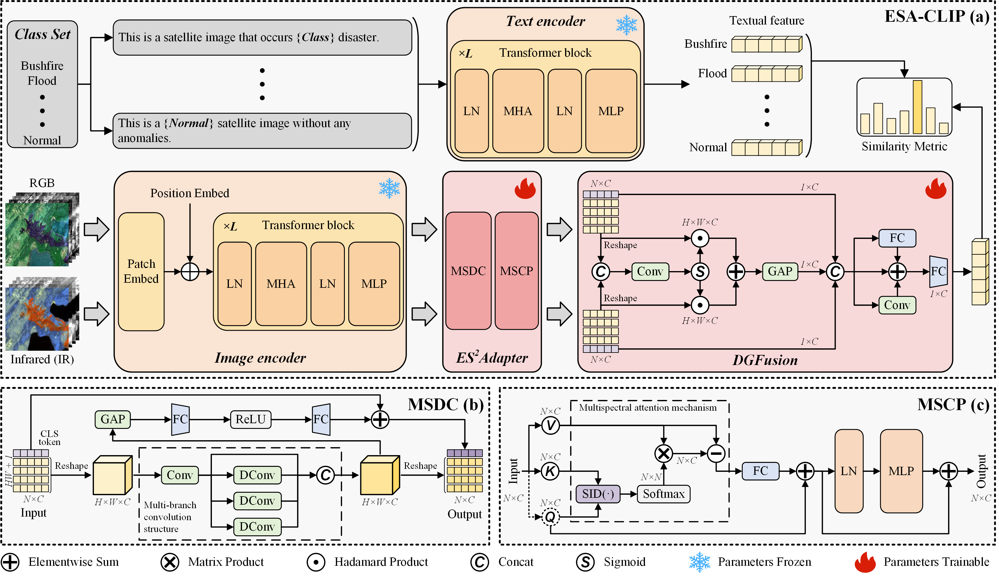

## [Exploring Infrared and Visible Feature Fusion for Earth Surface Anomaly Detection: From Benchmark Dataset to Spatial-Spectrum Adaptation Network](https://ieeexplore.ieee.org/document/11414162) 

*IEEE Transactions on Geoscience and Remote Sensing*, 2026, [Libo Wang](https://WangLibo1995.github.io), Dongxu Li, Zhi Gao, Wenquan Zhu, Qiao Wang.


## Abstract



**Earth surface anomaly detection (ESAD)** is a valuable and challenging research topic in the field of remote sensing. Earth surface anomalies (ESAs) occur infrequently, evolve rapidly, and demonstrate varied spectral characteristics, which pose huge challenges to existing ESAD methods. In this article, we propose a novel ESAD network based on the vision-language architecture, called ESA-CLIP, to strengthen the spectral feature representation of various ESAs. Specifically, an enhanced spatial-spectrum adapter (ES2Adapter) is developed to capture robust visual features while promoting cross-band feature interaction. Meanwhile, a dynamic gate fusion (DGFusion) is further constructed to fuse visible (RGB) and infrared (IR) spectral features effectively, thereby learning spectrum-sufficient feature representation. Furthermore, we built a multispectral ESAD (MS_ESAD) dataset to address the scarcity of existing ESA samples. This dataset collects 70 000 Sentinel-2 multispectral images and involves six spectral bands (SBs) and nine anomaly categories, providing foundational data support for ESAD research. Extensive ablation and comparative experiments on this dataset demonstrate the competitive performance of our ESA-CLIP compared to state-of-the-art scene classification methods and its potential toward general ESAD. The code and dataset will be available at: https://github.com/WangLibo1995/ESA_CLIP
  


## MS_ESAD Datasat


Download the [MS_ESAD](https://pan.baidu.com/s/1lk4wxi0oKI3HGm5hZTc0Sg?pwd=g1a5) dataset.

### Folder Structure
```none
MS_ESAD_256
├── Bluealgae
│   ├── RGB
│   │   ├── T09VVG_20230828_436.png
│   │   ├── T09VVG_20230828_437.png
│   │   ├── ···
│   ├── SWIR
│   │   ├── T09VVG_20230828_436.png
│   │   ├── T09VVG_20230828_437.png
│   │   ├── ···
├── Bushfire
├── Debrisflow
├── Farmlandfire
├── Flood
├── Forestfire
├── Greentide
├── Normal
├── Redtide
├── Volcano
```
### Data Preprocessing
```
python ESA_CLIP/geoseg/datasets/msesad_dataset.py
```

## Training

```
python train.py -c ESA_CLIP/config/ms_esad_256/ESA_CLIP.py
```

```
python train.py -c ESA_CLIP/config/ms_esad_256/ESA_CLIP_VIS.py
```


## Testing

```
python test.py -c ESA_CLIP/config/ms_esad_256/ESA_CLIP.py
```

```
python test.py -c ESA_CLIP/config/ms_esad_256/ESA_CLIP_VIS.py
```

## Citation

If you find this project useful in your research, please consider citing our paper：

[Exploring Infrared and Visible Feature Fusion for Earth Surface Anomaly Detection: From Benchmark Dataset to Spatial-Spectrum Adaptation Network](https://ieeexplore.ieee.org/document/11414162)

## Acknowledgement

- [pytorch lightning](https://www.pytorchlightning.ai/)
- [timm](https://github.com/rwightman/pytorch-image-models)
- [pytorch-toolbelt](https://github.com/BloodAxe/pytorch-toolbelt)
- [ttach](https://github.com/qubvel/ttach)
- [catalyst](https://github.com/catalyst-team/catalyst)
- [mmsegmentation](https://github.com/open-mmlab/mmsegmentation)